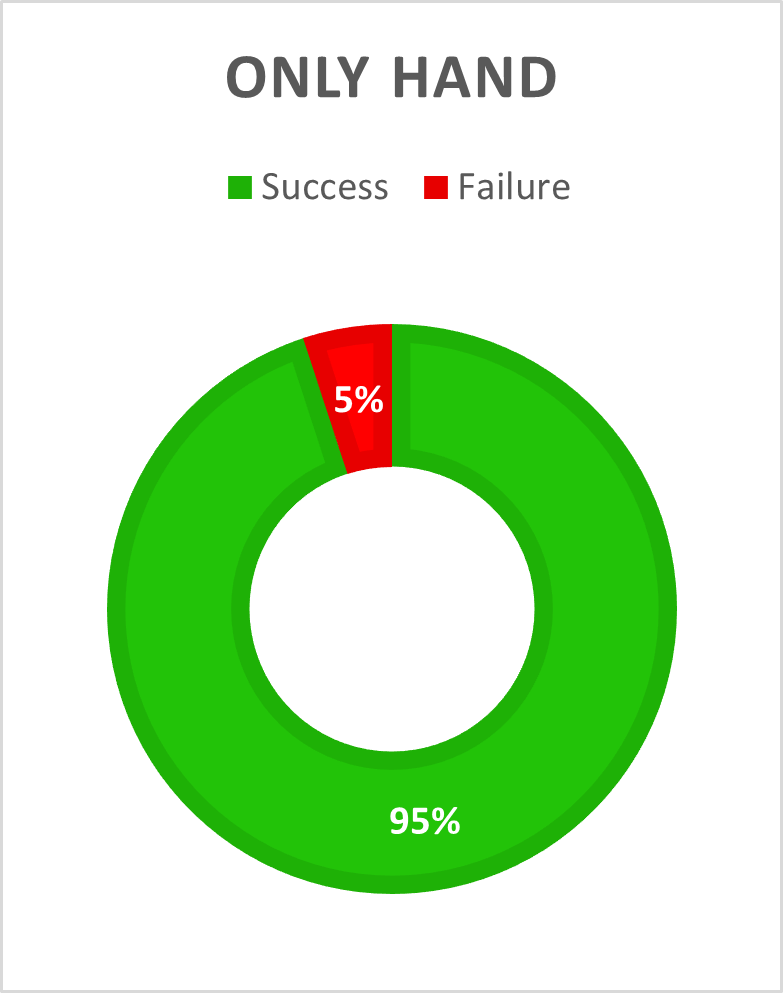

# Project Report for DPS920
Author: Le Minh Pham

## About This Project
**Hand Movement Tracking with OpenCV** is a video processing project in which the goal is to explore different approaches on how to detect and track hand movements in a video. The movements that we are currently tracking includes:
- Moving to the right
- Moving to the left
- Moving upward
- Moving downward
Hand movement tracking has many potential, especially in the fields of Internet of Things and Virtual Reality.

## Method
We analysed two different approaches: the segmentation method and the dense optical flow method. Both of the methods compare two consecutive frames to detect and track the movements. The segmentation method uses `cv.absdiff` to find the absolute difference between two frames and apply `cv.findContours` to detect the movement. Meanwhile, the dense optical flow method uses `cv.calcOpticalFlowFarneback` function to calculate the flow vectors of the movement. It then calculate the direction of movement and produce a result. Overall, the dense optical flow method are more effective than the segmentation method in tracking hand movements

## Data & Test Result
The data we use for this project is live video feed from a webcam. We divided the data into 3 test cases based the interference of other objects with the hand:
- Test case 1: Video with only a hand and no other objects.
- Test case 2: Video with a hand and a face, to test if skin color will affect the detection
- Test case 3: Video with a hand and another moving object in the frame.

| Test Case # | Description                                  | Success Rate | Fail Rate | Snapshot                      |
| ----------- | -------------------------------------------- | ------------ | --------- |
| 1           | Video with only a hand and no other objects. | 95%          | 5%        |  |
